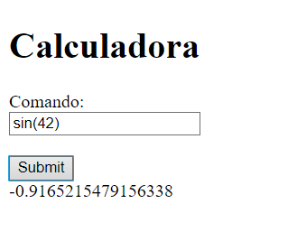
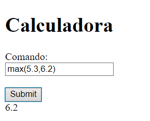

# Bono parcial-Primer Corte AREP 2024-1

---

## Descripción del Proyecto

Para el desarrollo del bono, ejecutaremos el mismo proyecto del parcial ***ReflexCalulator*** que es una pagina web que
es una calculadora que recibe la operación que vamos hacer y entre parentesis los diferentes parametros, aparte de las
operaciones normales, nos permite ordenar una lista de numeros atravez del algoritmo ***BubbleSort*** (Funciona con el 
comando ***bbl***). Este nos muestra abajo la respuesta.

---

## Requisitos Funcionales
* La caculadora  (ReflexCalculator) es la que hace el computo real de las funciones. La fachada de servicios (ServiceFacade) solo delega el computo al ReflexCalculator.
* El diseño de los servicios WEB debe tener en cuenta buenas prácticas de diseño OO.
* Despliegue los servicios en máquinas virtuales separadas.
* Los llamados al servicio de calculadora desde el cliente deben ser asíncronos usando el mínimo JS prosible. No actualice la página en cada llamado, solo el resultado.
* El API de la fachada será:
  - [url de la app]/calculadora : Este servicio entrega el cliente web en formato html + js.
  - [url de la app]/computar?comando=[comando con parámetros separados por coma entre paréntesis] : retorna el valor solicitado en formato JSON.
* El API de la calculadora será:
  - [url de la calculadora]/compreflex =[comando con parámetros separados por coma entre paréntesis] :retorna el valor solicitado en formato JSON.
* Asegúrese de retornar los encabezados correctos en HTTP y de responder mensajes válidos de HTTP ante solicitudes inesperadas.
---

## Arquitectura


* La aplicación tendrá tres componentes distribuidos: Una fachada de servicios, un servicio de calculadora, y un cliente web (html +js).
* Los servicios de la fachada y de la calculadora deben estar desplegados en máquinas virtuales de java  diferentes (NO tiene que usar docker ni AWS).
* El cliente es un cliente web que usa html y js. Se descarga desde un servicio en la fachada (Puede entregar el cliente directamente desde un método no es necesario que lo lea desde el disco).
* La comunicación se hace usando http y las respuestas de los servicios son en formato JSON.
---

## Ejecución del Proyecto
### Requisitos:
* __Java__: Version 11 o superior.
* __JDK__: kit de desarrollo de java- versión 8 o superior.
* __Browser__: Cualquier navegador para abrir la aplicación web.
* __Maven__: Para compilar el proyecto.

> [!IMPORTANT]
> En este proyecto se utilizo la versión de Java 17 y Maven 3.9.5
---
## Instalación

* Primero, descarga el proyecto:

    ```bash
    git clone https://github.com/SebZaUr/Bono-Parcial.git
    ```

* Entra en el directorio del proyecto:

    ```bash
    cd Bono-Parcial
    ```

* Compila el proyecto usando Maven:

    ```bash
    mvn clean compile
    ```

* Ejecute los siguientes comandos en cmds diferentes:

    ```bash
    java -cp target/classes arep.bono.CalcReflex
    ```

  ```bash
    java -cp target/classes arep.bono.CalcReflexFachada
    ```

El proyecto ya está en funcionamiento. Para abrirlo, haz clic en este enlace en tu navegador: [CalculadoraBono](http://localhost:36200/calcular).

---

## Pruebas

Probamos nuestras calculadora para los siguientes casos:
* __Un parametro:__

  
* __Dos Parametros:__

  
* __BBL:__

  
---

## Licencia
Este proyecto está bajo la licencia de Creative Commons Reconocimiento-CompartirIgual 4.0 Internacional (CC BY-SA 4.0) - Ver el archivo [LICENSE](LICENSE.md) para más detalles.

---
### Autor:
* __Sebastian Zamora Urrego__

